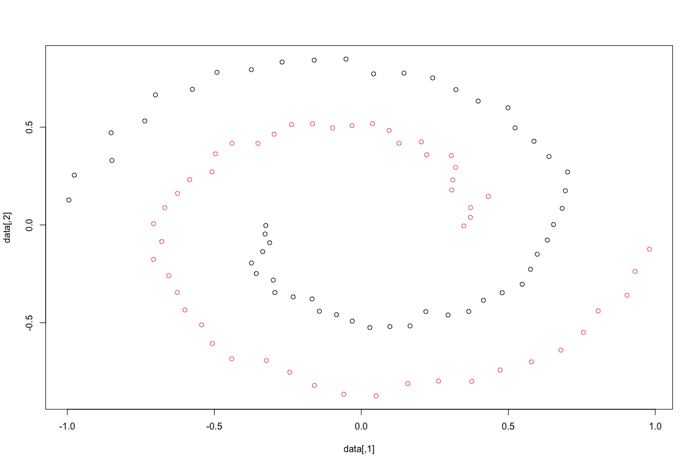

# Graph Clustering Techniques

## Erdös-Rényi Graph Analysis and Degree Distribution

Focuses on the exploration and analysis of Erdös-Rényi graphs:

- **Graph Generation**: Simulate Erdös-Rényi graphs for varying node counts (`n`) and edge probabilities (`p`).
- **Degree Distribution Analysis**: Compare empirical degree distributions of these graphs with theoretical Binomial and Poisson models.
- **Parameter Estimation**: Estimate the edge probability parameter `p` and analyze its relative error.
- **Graph Behavior Insights**: Provide explanations on graph characteristics based on the `np` value, such as connected component sizes and the presence of a giant component.
- **Error and Distribution Plots**: Utilize plots to illustrate degree distributions and relative errors in parameter estimations.

## Configuration Models and Graph Rewiring

Tools and algorithms for working with Configuration Models in graph analysis:

- **Power-Law Fitting**: Fitting a power-law to the degree distribution of graphs, exemplified with the karate graph.
- **Degree Distribution Analysis**: Analyzing and plotting degree distributions, excluding zero degrees, to understand graph structure.
- **Random Degree Model**: A function to calculate the expected degree under the Random Degree (RD) model for given parameters.
- **Graph Rewiring Algorithms**: Implementation of matching and re-branching algorithms for graph rewiring, essential for understanding graph dynamics and properties.

## Spectral Clustering Algorithms

Delving into the creation and analysis of spectral clustering methods:

### Part 1: Implementing Clustering Algorithms
- **Normalized and Absolute Clustering**: Develop R functions for both types of spectral clustering, utilizing eigenvalues of Laplacian matrices.
- **Graph Inputs**: Enable input of adjacency matrices and desired cluster numbers for processing.

### Part 2: Analysis and Testing on Simulated Graphs
- **Graph Simulation**: Utilize various graph types, including `G(n,p)` and multi-community graphs, for testing.
- **Spectral Analysis**: Investigate the Laplacian spectra for effective cluster number determination.
- **Comparative Study**: Analyze the efficacy of clustering by comparing results from different classification methods, addressing label switching.

### Part 3: Real-World Application and Interpretation
- **Application on Real Graphs**: Apply developed algorithms to real-world graphs like the karate graph.
- **Result Analysis**: Interpret the clustering outcomes to evaluate algorithm performance and effectiveness.

## Similarity Graphs

Analysis of similarity graph construction and its effect on clustering:

- **K-Means Clustering**: Application on a two-spiral dataset to form two clusters, followed by a visualization and analysis of the results.
- **Gaussian Similarity & Spectral Clustering**: Calculation of Gaussian similarities between data points, then applying normalized and absolute spectral clustering, with visualization and interpretation of the results.
- **Variety of Similarity Graphs**: Construction and clustering analysis on several similarity graphs, including:
   - $\varepsilon$-neighborhood graphs using 75% and 95% quantiles.
   - Valued graphs based on mutual and simple neighbors, considering different neighbor counts.

